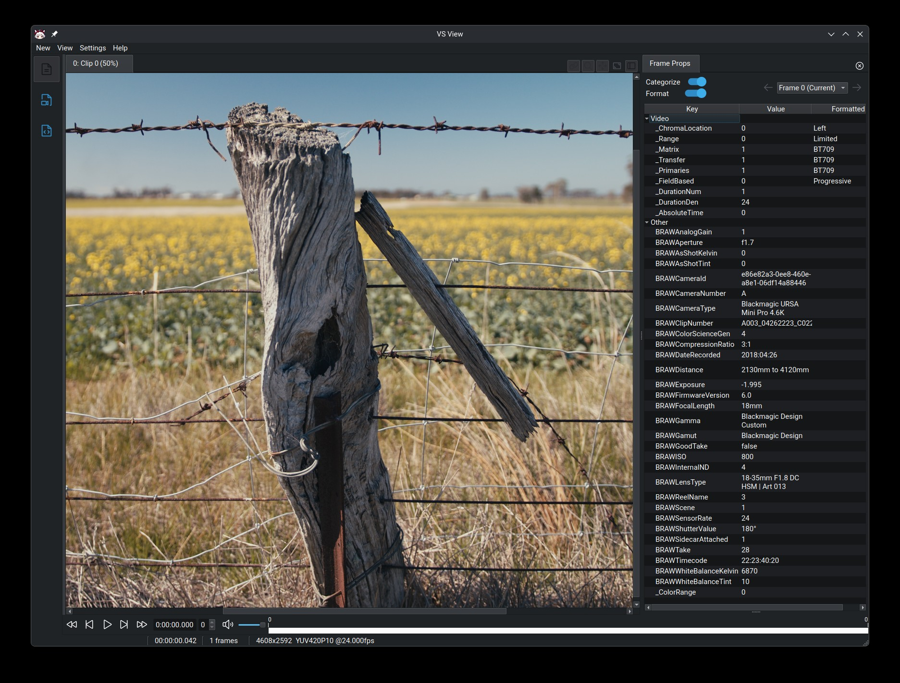

# brawsource (beta)

Dual VapourSynth / AviSynth+ source plugin for Blackmagic RAW (`.braw`),
written in Zig against the official Blackmagic RAW SDK (CPU + GPU decode).
Frame-exact random access, audio, frame properties from clip/frame metadata.

- **VapourSynth**: `braw.Source` + `braw.AudioSource` — Linux x64, Windows x64, macOS (x64/arm64)
- **AviSynth+**: `BRAWSource` (video + audio track) — Windows x64, AviSynth+ 3.6+ (interface V8)



## Install

VapourSynth users can install straight from PyPI — runtime included,
no DaVinci Resolve needed:

```sh
pip install vapoursynth-brawsource
```

The wheels are baseline x86-64; for the faster `-v3` builds (AVX2/F16C)
or the AviSynth+ plugin, grab a release zip below.

System requirements: macOS 12+ (the BRAW 5.1 runtime's floor). On Linux
the bundled runtime additionally needs the system `libGL.so.1` (Mesa) and
`libuuid.so.1` — present on practically every desktop distribution.

## Runtime

The plugin loads the Blackmagic RAW runtime at run time. **The release zips
are batteries-included**: they ship the runtime in a
**`blackmagic_win_deps`** / **`blackmagic_linux_deps`** /
**`blackmagic_mac_deps`** folder next to the plugin — extract into your
plugin directory and you're done. For custom setups the same folder
convention works with your own copy of the runtime; alternatively an
installed Blackmagic RAW / DaVinci Resolve is found automatically, or use
the `libpath` parameter / `BRAW_LIBRARY` env var.

x86_64 builds come in two flavors: the plain one runs on any CPU, the
**`-v3`** one (x86-64-v3: AVX2/F16C, Intel Haswell 2013+ / AMD Excavator+)
has noticeably faster pixel-copy loops — prefer it on any recent machine.

## Usage

```python
clip  = core.braw.Source(source="clip.braw")        # bit depth automatic
audio = core.braw.AudioSource(source="clip.braw")
```

```
BRAWSource("clip.braw", bitdepth=32)                 # AviSynth, audio attached
```

Parameters (both frameworks):

| Parameter | Description |
|---|---|
| `bitdepth` | 8, 16 or 32 (32 = float). Unset = auto: 16-bit, or 32-bit float for Linear gamma. `fp=true` with 16 = half float (VapourSynth only) |
| `audio` | AviSynth only: attach audio track (default true) |
| `scale` | decode at 1/2/4/8 resolution |
| `pipeline` | VapourSynth only: decode on `cpu` (default), `cuda` (NVIDIA, Linux/Windows), `metal` (Apple GPU, macOS) or `opencl` (any OpenCL GPU — the option for AMD/Intel). On Apple Silicon `metal` is 1.7-2.7x faster and leaves the CPU nearly idle; CUDA helps mainly at high resolution; `opencl` sits between CPU and CUDA (~1.6x CPU on an RTX 3080). See `doc/gpu-benchmark.md` |
| `kelvin, tint, exposure, iso` | per-frame processing overrides |
| `gamma, gamut, colorscience` | color science overrides (e.g. `gamma="Rec.709"`); invalid values error at open |
| `highlightrecovery, gamutcompression` | processing toggles |
| `allmetaprops` | expose every metadata key as `BRAW_<key>` frame prop |
| `threads` | CPU decode threads (`SetCPUThreads`); 0 = all hardware threads. Lower it to leave cores free for downstream filters — the BRAW decoder otherwise saturates every core |
| `libpath` | Blackmagic RAW library file or directory |

Defaults decode "as shot": camera metadata plus an auto-applied
`<clipname>.sidecar` next to the file (reported via the
`BRAWSidecarAttached` prop; parameters override both).

Frame props: `_DurationNum/Den`, `_AbsoluteTime`, `_Matrix`, `_Range` (AviSynth: `_ColorRange`)
(+`_Transfer`/`_Primaries` when the gamma/gamut has a standard code), plus
`BRAWTimecode`, `BRAWISO`, `BRAWWhiteBalanceKelvin/Tint`, `BRAWExposure`,
camera/clip info as `BRAW*`. Inspect everything with
`braw-probe --list-attrs --all-meta clip.braw`.

## Building

Zig 0.16; SDK headers are vendored, nothing else needed.

```sh
zig build                  # plugins into zig-out/{vapoursynth,avisynth}, braw-probe into zig-out/bin
zig build test             # unit tests
zig build release          # all targets, ReleaseFast, into zig-out/release/
tools/extract-sdk.sh       # unpack SDK/runtime into third_party/ (dev/tests)
```

## License

Plugin code: see LICENSE. Vendored SDK headers (`vendor/`) are Copyright
Blackmagic Design, license in their file headers. The Blackmagic RAW
runtime ("API Libraries") is explicitly redistributable together with
software built on the SDK (Blackmagic RAW SDK Developer License §1.1(d)),
so plugin bundles may ship it in the `blackmagic_*_deps` folder. This
repository just doesn't vendor the binaries — `tools/extract-sdk.sh`
unpacks them locally, or take them from a Blackmagic RAW install.
